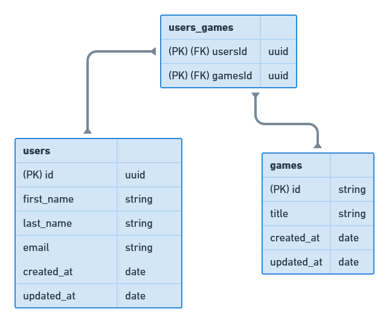

# [Desafio 3 do Ignite Trilha NodeJS](https://www.notion.so/Desafio-02-Modelagem-do-banco-de-dados-0ce9c10f9e114be0a9ee9359d68639ff)

 

# 💻 Sobre o desafio

Nesse desafio você irá incrementar a aplicação feita no desafio anterior.

<aside>
⚠️ Atenção: Essa será apenas a modelagem do banco de dados, portanto não requer nenhum código.

</aside>

A aplicação deve ter uma tabela de gêneros (`genres`) para que cada jogo possa ter um ou mais gênero e, além disso, uma tabela `orders` deve existir para que um usuário consiga comprar um ou mais jogos na mesma compra.

Um extra seria colocar as cardinalidades entre as entidades mas não tome isso como obrigatório.

# Diagrama

 

Feito com 💜 by <a href="https://www.linkedin.com/in/mattcarval/">Mattcarval</a> :wave:
